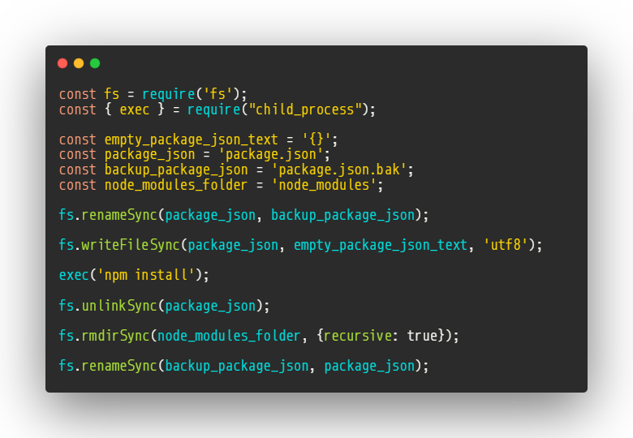

<p align="center">
  <a href="./docs/img/code_nodules_remover.png" rel="noopener">
 </a>
</p>

<div align="center">

# Fast remover for node modules

[](https://github.com/Marfullsen/safe-node-modules-remover)

</div>

## Table of Contents

- [About](#about)
- [Getting Started](#getting_started)
- [Usage](#usage)
- [Contributing](../CONTRIBUTING.md)

## About <a name = "about"></a>

Wanna delete the **Node Modules** directory but it could take a lot? Use **NPM Install** with a blank _packages.json_ and it'll take ReaLLy less.

<p align="center">
  <a href="./docs/img/code_nodules_remover.png" rel="noopener">
 </a>
</p>

## Getting Started <a name = "getting_started"></a>

To use this file just move **index.js** to the root of your project and run it with **node**.

### Prerequisites

Have a project with any project with an annoying _node modules_ directory.

## Usage <a name = "usage"></a>

- Place the **index.js** file into your project root, beside the _node modules_ directory.

- run the file **with node.js**

```
node index.js
```
- now the _node modules_ directory should be empty and your project should be ready for being moved or deleted.

## Special thanks

- [freepik.com](https://www.freepik.com/)